# River Pollutant Dispersion Simulator

<p align="center">
  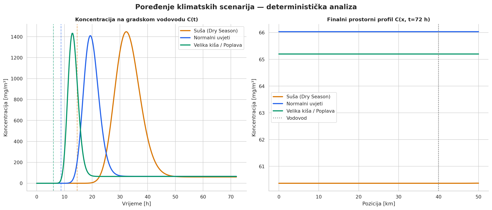
</p>

<p align="center">
  <b>Monte Carlo simulation of chemical pollutant transport in a river watershed</b><br/>
  1D advection–diffusion · Ornstein–Uhlenbeck stochastic flow · Gaussian Process metamodel · Differential evolution optimisation
</p>

<p align="center">
  
  
  
  
</p>

---

> **Academic context** — Topic 12: *Pollutant Dispersion in a River Watershed*  
> Course: Computer Modelling and Simulation  
> Author: Nejra Smajlović (136)

---

## Table of Contents

- [Overview](#overview)
- [Simulation Results](#simulation-results)
  - [Deterministic Baseline](#1-deterministic-baseline)
  - [Stochastic Flow](#2-stochastic-flow--warmup-validation)
  - [Monte Carlo](#3-monte-carlo-analysis)
  - [Metamodel](#4-surrogate-metamodel)
  - [Sensitivity Analysis](#5-sensitivity-analysis)
  - [What-If Analysis](#6-what-if-analysis)
- [Architecture](#architecture)
- [Quick Start](#quick-start)
- [Docker](#docker)
- [Configuration](#configuration)
- [Dependencies](#dependencies)

---

## Overview

A full simulation pipeline that models how a chemical pollutant spill travels downstream along a 50 km river and reaches a municipal water intake at 40 km. The framework answers three key questions:

1. **When** does the pollutant arrive at the water intake?
2. **How concentrated** is it at peak?
3. **Which parameters** drive the risk — and what is the absolute worst case?

The pipeline runs eight sequential steps: deterministic baseline → Monte Carlo → statistical analysis → surrogate metamodel → sensitivity analysis → differential-evolution optimisation → what-if grid sweeps.

### Key Results

| Scenario | Arrival time (mean) | Peak concentration (mean) | Arrival probability |
|----------|-------------------|--------------------------|-------------------|
| Dry season | **14.46 ± 0.64 h** | 1 452 mg/m³ | 100 % |
| Normal flow | **8.56 ± 0.48 h** | 1 418 mg/m³ | 100 % |
| Heavy rain | **5.94 ± 0.50 h** | 1 449 mg/m³ | 100 % |
| Worst case (optimised) | **3.38 h** | **5 878 mg/m³** | — |

---

## Simulation Results

### 1. Deterministic Baseline

Three climate scenarios solved with constant mean velocity — dry season, normal flow, and heavy rain / flood.

<p align="center">
  
</p>

**Space-time concentration heatmaps** — the plume travels faster and spreads wider under rainy conditions:

| Dry season | Normal flow | Heavy rain |
|:---:|:---:|:---:|
| 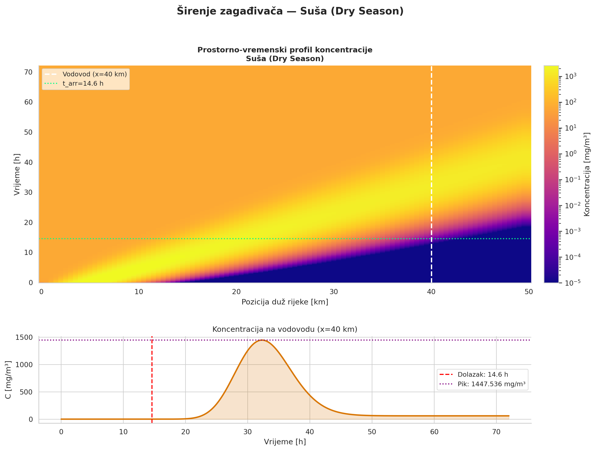 | 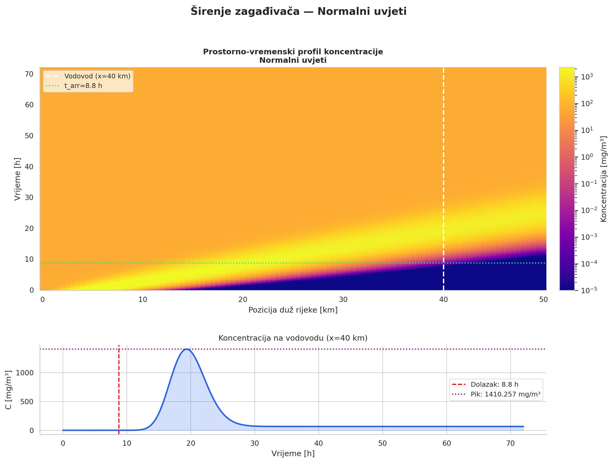 | 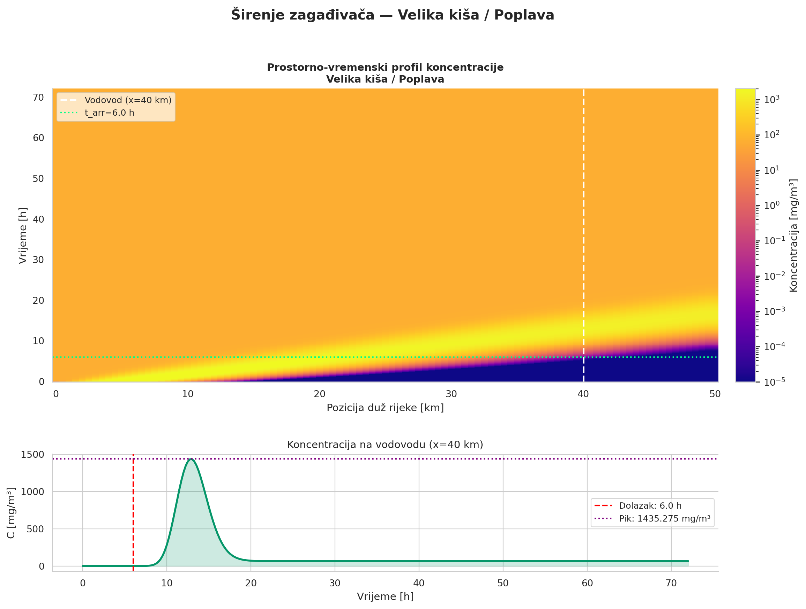 |

**Spatial concentration snapshots** at selected time steps:

| Dry season | Normal flow | Heavy rain |
|:---:|:---:|:---:|
| 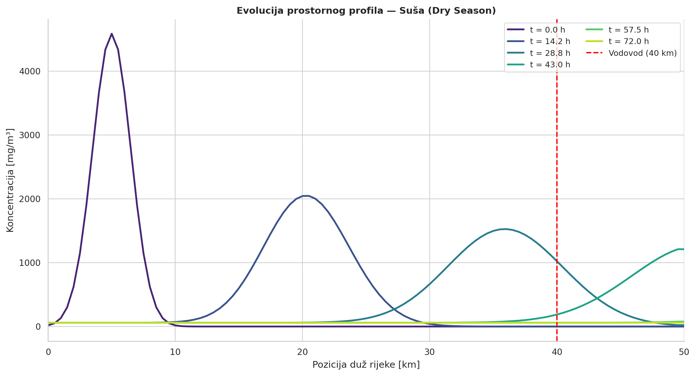 | 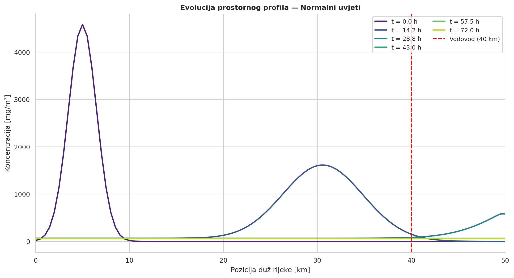 | 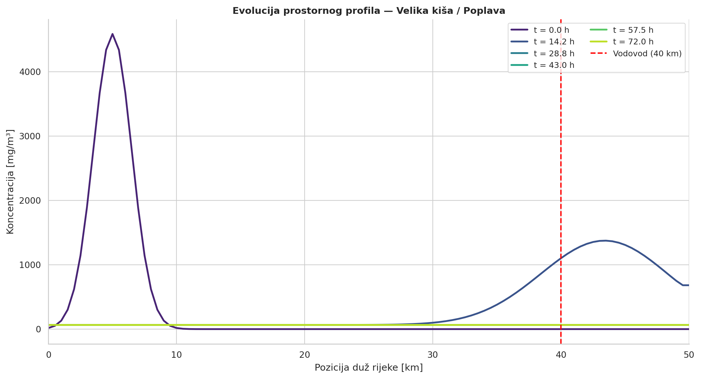 |

---

### 2. Stochastic Flow & Warmup Validation

River velocity is modelled as an **Ornstein–Uhlenbeck process** (`dU = θ(μ−U)dt + σdW`). Welch's periodogram confirms the warmup period (3τ = 3 h) is sufficient to reach stationarity before the simulation clock starts.

<p align="center">
  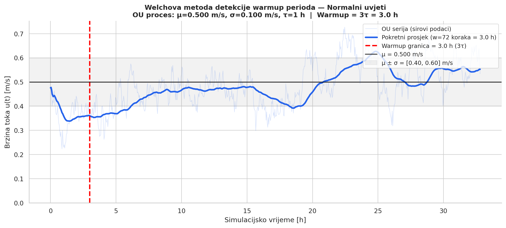
</p>

<p align="center">
  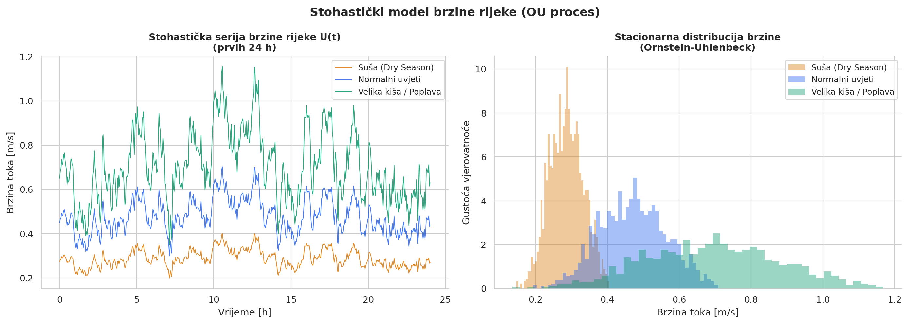
</p>

Sequential confidence-interval narrowing determines the minimum number of Monte Carlo replications required (target relative CI width ≤ 5 %):

<p align="center">
  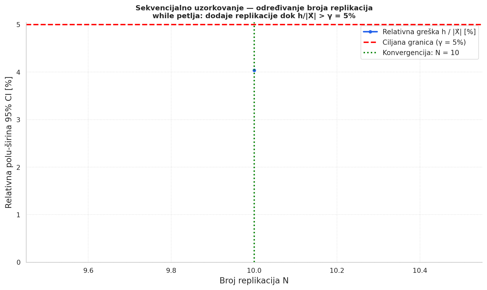
</p>

---

### 3. Monte Carlo Analysis

N stochastic replications per scenario, each with an independently seeded OU velocity process. The 95 % confidence bands show the envelope of possible concentration histories at the water intake.

<p align="center">
  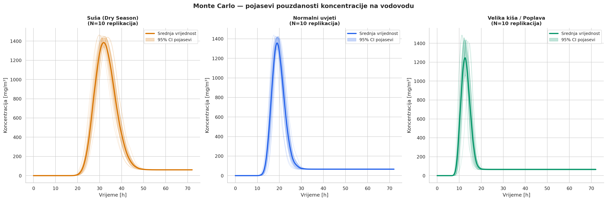
</p>

Histograms of arrival time and peak concentration across all replications, with 95 % CI marked:

<p align="center">
  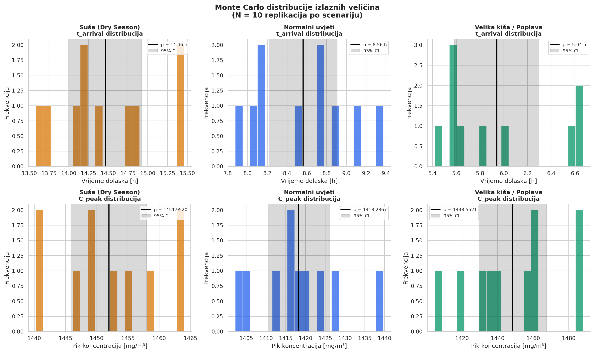
</p>

| Scenario | t_arrival 95 % CI | C_peak std | Shapiro–Wilk (normal?) |
|----------|------------------|-----------|----------------------|
| Dry | [14.00, 14.92] h | ±8.5 mg/m³ | ✅ p = 0.553 |
| Normal | [8.22, 8.91] h | ±10.8 mg/m³ | ✅ p = 0.775 |
| Rainy | [5.59, 6.30] h | ±26.7 mg/m³ | ❌ p = 0.024 |

---

### 4. Surrogate Metamodel

A Latin Hypercube Sample (400 points over the 4D parameter space) trains four surrogate models. **Gaussian Process** wins by cross-validated R²:

| Model | R² CV (t_arrival) | R² CV (C_peak) |
|-------|-----------------|---------------|
| **Gaussian Process** | **0.900** | **0.996** |
| Random Forest | 0.891 | 0.974 |
| Gradient Boosting | 0.884 | 0.992 |
| HistGradient Boosting | 0.884 | 0.990 |

Parity plots — predicted vs. exact simulation values on a held-out test set:

<p align="center">
  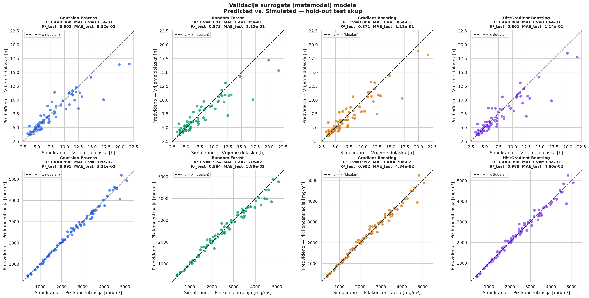
</p>

---

### 5. Sensitivity Analysis

One-At-a-Time (OAT) sweep ±30 % around nominal values for each of the four input parameters. Normalised sensitivity indices:

<p align="center">
  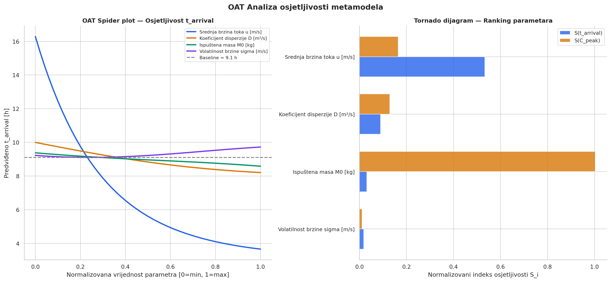
</p>

| Parameter | S(t_arrival) | S(C_peak) | Dominant effect |
|-----------|-------------|----------|----------------|
| Mean velocity u [m/s] | **0.533** | 0.165 | Controls arrival time |
| Dispersion D [m²/s] | 0.089 | 0.129 | Moderate effect on both |
| Released mass M₀ [kg] | 0.031 | **1.003** | Linearly scales peak concentration |
| Velocity volatility σ [m/s] | 0.018 | 0.011 | Minimal impact |

---

### 6. What-If Analysis

Exact 30×30 grid sweeps over pairs of parameters, computing both arrival time and peak concentration at every point.

**Flow velocity vs. dispersion coefficient:**

<p align="center">
  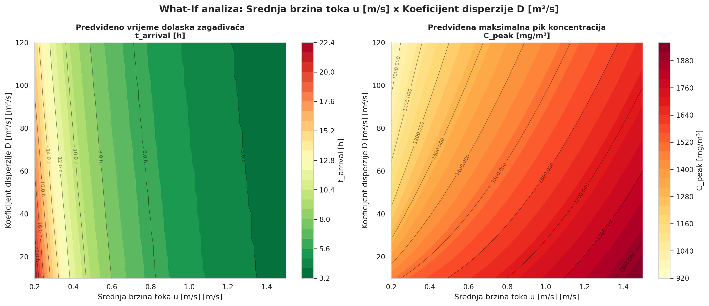
</p>

**Released mass vs. flow velocity:**

<p align="center">
  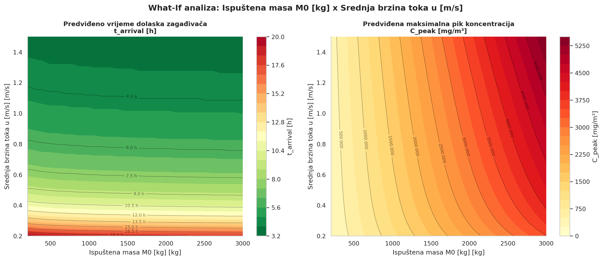
</p>

---

## Architecture

```
river-pollutant-dispersion/
├── main.py                    # 8-step pipeline orchestrator
├── pyproject.toml             # Project metadata & dependencies (uv)
├── Dockerfile                 # Container image
├── docker-compose.yml         # One-command containerised run
├── images/                    # Generated figures (PNG / PDF / SVG)
└── src/
    ├── config.py              # All physical constants & climate scenarios
    ├── logger.py              # Structured logging
    ├── stochastic_flow.py     # Ornstein-Uhlenbeck river-flow model
    ├── advection_diffusion.py # 1D ADE finite-difference solver
    ├── simulator.py           # Single-replication orchestrator
    ├── replication_manager.py # Monte Carlo manager & N-determination
    ├── statistics.py          # CI, Shapiro-Wilk, summary tables
    ├── metamodel.py           # LHS + GP / RF / GB surrogate training
    ├── sensitivity.py         # OAT sensitivity analyser
    ├── optimizer.py           # Differential evolution & what-if grid
    └── plotter.py             # All matplotlib/seaborn visualisations
```

---

## Quick Start

**Requirements:** Python 3.11+, [uv](https://github.com/astral-sh/uv)

```bash
git clone https://github.com/itsnejra/river-pollutant-dispersion.git
cd river-pollutant-dispersion

# Install dependencies
uv sync

# Run the full pipeline (~2 min on a modern laptop)
uv run python main.py
```

Output figures are written to `images/` as `.pdf`, `.svg`, and `.png`.

---

## Docker

```bash
# Build and run (figures written to ./images on the host)
docker compose up --build

# Or with plain Docker
docker build -t river-pollutant .
docker run --rm -v "$(pwd)/images:/app/images" river-pollutant
```

---

## Configuration

All physical and numerical parameters are centralised in [`src/config.py`](src/config.py).

### Climate Scenarios

| Scenario | u_base (m/s) | σ_u (m/s) | D (m²/s) | Description |
|----------|-------------|-----------|----------|-------------|
| `dry` | 0.30 | 0.05 | 20 | Low flow, high retention |
| `normal` | 0.50 | 0.10 | 50 | Average hydrological regime |
| `rainy` | 0.75 | 0.20 | 80 | Elevated post-rainfall flow |

### Key Physical Parameters

| Parameter | Value | Description |
|-----------|-------|-------------|
| River length | 50 km | 1D domain extent |
| Spatial nodes | 101 | Grid resolution (dx = 500 m) |
| Water intake | 40 km | Point of interest |
| Pollutant mass | 1 000 kg | Instantaneous Gaussian release |
| Release position | 5 km | Upstream spill location |
| Time step dt | 150 s | CFL and diffusion stability satisfied |
| Simulation window | 72 h | Total integration time |

### Numerical Stability

```
Courant number:   Co = u·dt/dx ≤ 1.0   ✅
Diffusion number: d  = D·dt/dx² ≤ 0.5  ✅
```

Both are checked at initialisation and raise `ValueError` on violation.

---

## Dependencies

| Package | Purpose |
|---------|---------|
| `numpy` | Vectorised numerics |
| `scipy` | `lfilter` (OU exact discretisation), `differential_evolution`, stats |
| `scikit-learn` | GP / RF / GB metamodels, LHS sampling |
| `matplotlib` | All figures |
| `seaborn` | Distribution plots |
| `pandas` | Summary tables |

---

## License

MIT — see [LICENSE](LICENSE) for details.
